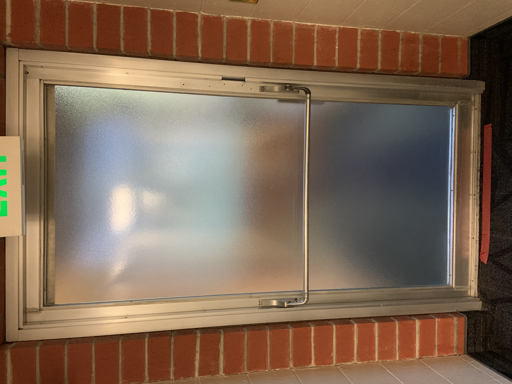
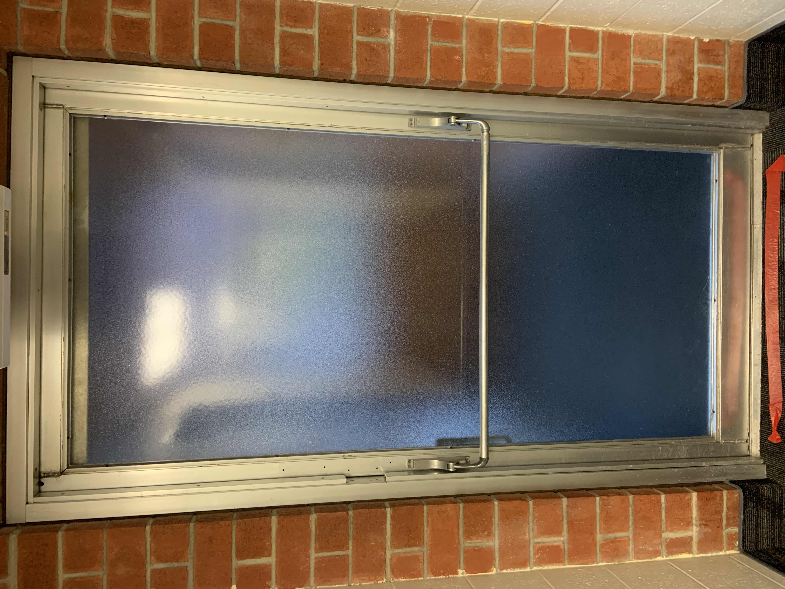
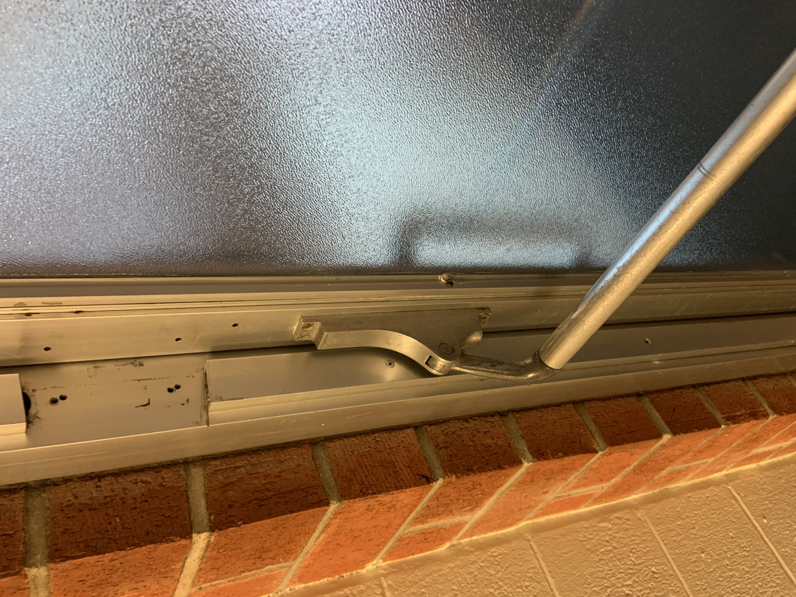

# Lassen and Shasta's Tower Doors

### By Christian Hodges

So as you can imagine, the goal of a door is pretty self-explanatory: to get to the other side easily. Most of the time, this is not an issue that we figured out a pretty good way to signal to the user (person pushing/pulling on the door) how to open the door. Altough, I want to show you this wonderful door that I found while living on campus at CSU Chico in Lassen and Shasta residential halls. 

These doors as shown above a opaque glass doors with a horizontal bar a little bit lower than halfway down the door. Just by looking at the door we can assess the **affordances** given by the object. We know that it is a door because there is what looks like a door frame with what we can assume is a push bar. We could pull on the horizontal bar, but with the angled mechanism shown here:

it would seem to afford that pushing on the door is how we open it. Not to anyone's surprise, the door is able to be opened by pushing on the horizontal bar, but the interesting part is which side that opens. One can only tell which side will swing open based on a small divit in the door frame. There is no other way to check which side of the door will open and which side is connected to the hinges. There have been many times that I would push on the wrong side of the door since I wasn't paying that much attention. For this reason, I just ended up pushing on the middle part of the horizontal bar so that I wouldn't have to think about it. This meant that the door was a little bit harder to push, but I never got it wrong again.

I'll now list each of the UX goals from the S.E.E. M.U.L.E.S. acronym and explain how each of the UX are or are not met:

- **Safety**: This door has a slow closing feature so that the door doesn't slam into anyone which is nice.
- **Effectiveness**: Apart from the small hicup discussed in the journal above, this door is effective at sectioning off the building.
- **Learnable**: This object is a daily occurance to the usual person so this object doesn't need to be learnable since most folks know how to use it.
- **Useful**: This object is a simple door and therefore is useful in partitioning off sections of a building.
- **Efficiency**: This is, I would argue, the **most important goal** for a door. A person should be able to efficently use a door without thinking about it, but every time I come across this door I need to stop and think about how to open it or push on the center of the horizontal bar.
- **Error Tolerance**: This door is very error tolerant because if you push on the wrong size of the door then simply nothing happens. If this door had a bad error tolerance then the door would break.
- **Memorability**: This is a normal door that everyone encounters daily so this object doesn't need to be memorable on its own.

[back to portfolio](../../) | [next journal](../j02)