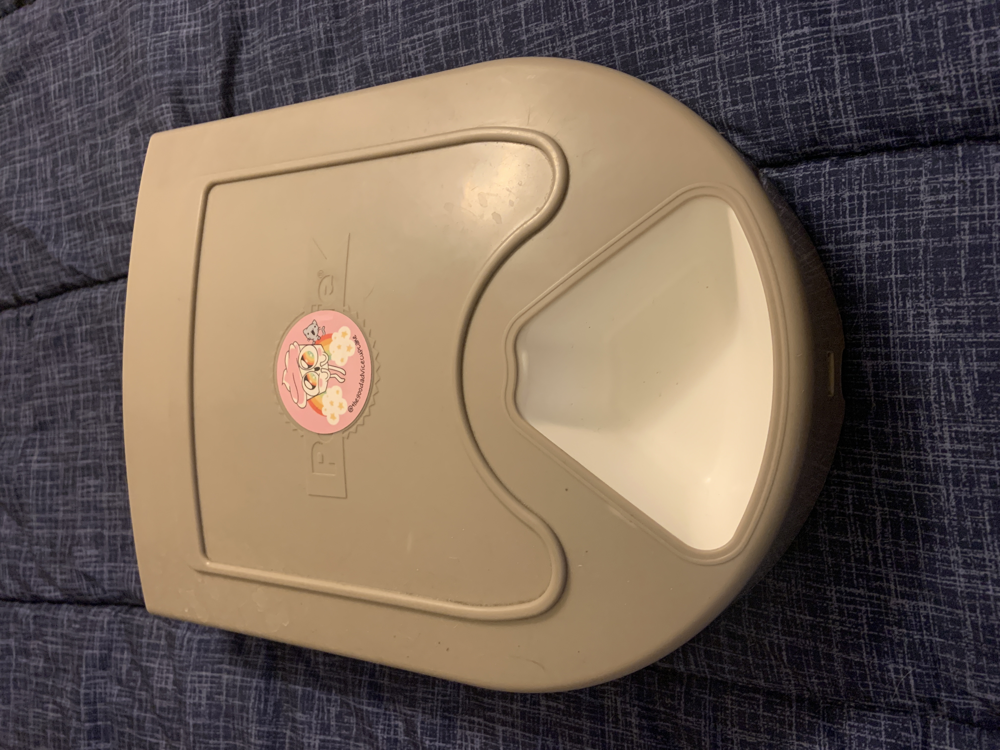
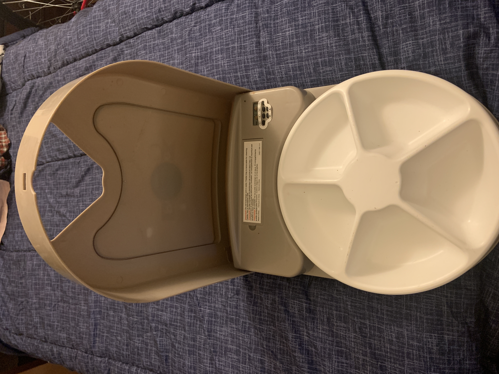
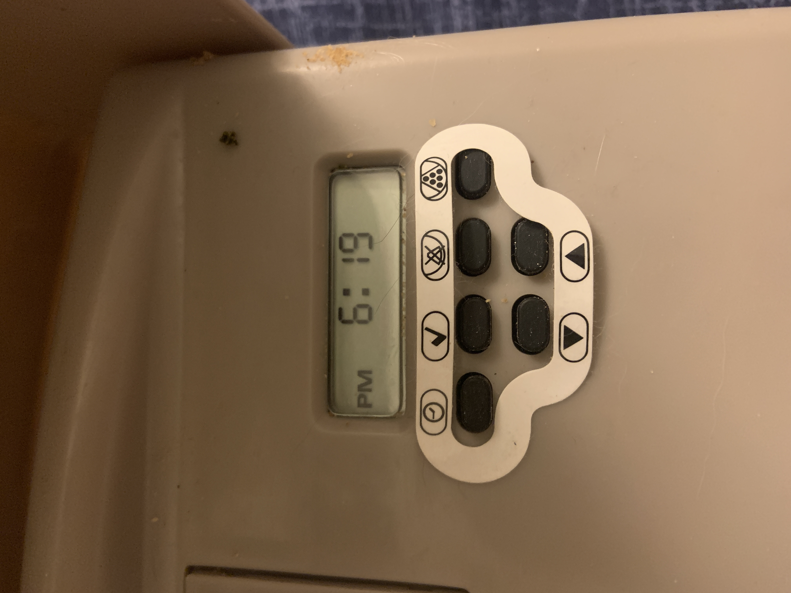
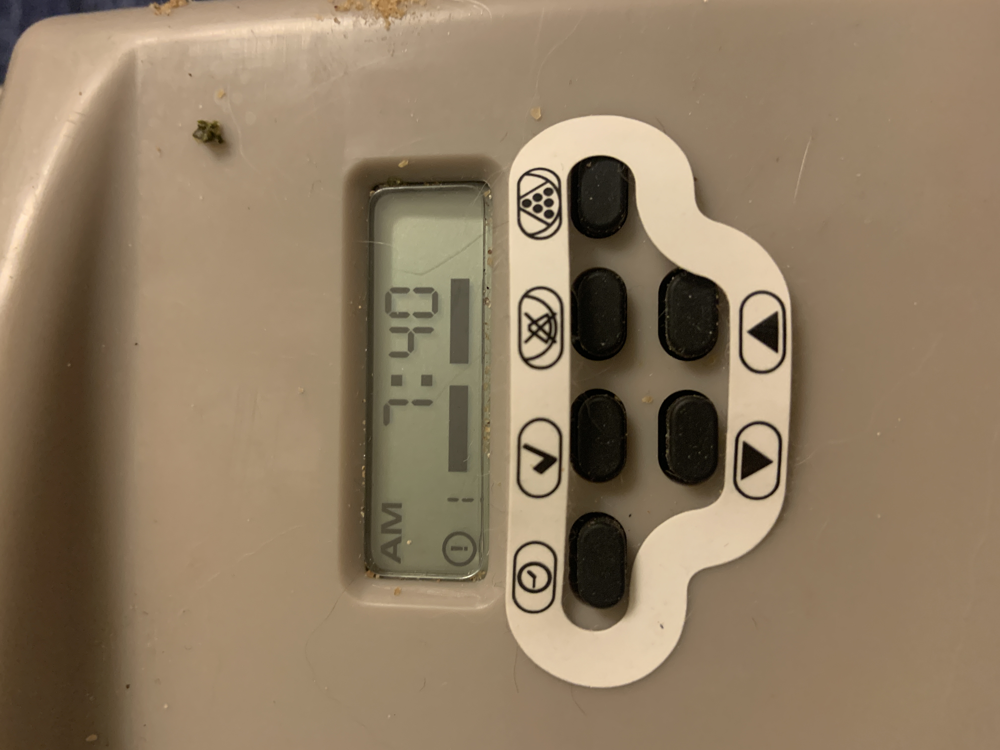
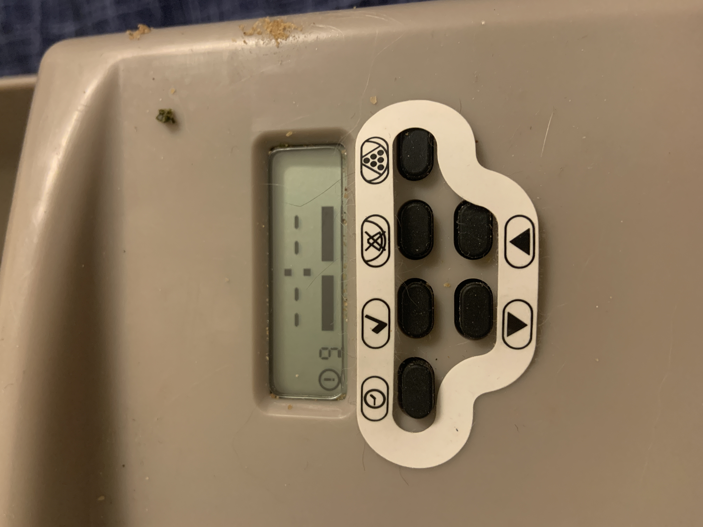

# 5-Day Cat Auto-Feeder

### By Christian Hodges

A one can imagine, the goal of an auto-feeder is to be able to feed your pet automatically. Since I have a cat, one benefit that I've gained since using an auto-feeder is that my cat doesn't yell-meow at me in the mornings to give her food. It just magically appears in her bowl after some mechanical gear sounds as far as she knows. Overall I do love this feeder and how it is cat-proof to my monster of a cat Ziggy. I used to own a gravity feeder that had a similar mechanism of dispensing food at a certain time, but my cat was able to figure out how to sneak food out by sticking her paws up the feeder. 

Here is another picture of the feeder but with the lid open:

From the picture above, you can see that there are only 5 spots to put food so this means that it's a little tedious that I have to refill the bowl every 4 days. This is a lot more often than how often one has to refill other types of auto-feeders, but as I stated before, this feeder is cat-proof insofar as it stops Ziggy from getting extra food.

In terms of other feeders I think that this feeder is more geared towards **personas** with a **scenario** similar to mine: a monster-cat who is able to figure out how to get more food out of a feeder than intended. Though, there are also feeders that are able to stop cats from being able to steal other cat's food. I distinctly remember seeing a feeder at the pet store that would only open to a tag on a collar. This would stop pet A from being able to eat pet B's food, but in my **scenario** I want an auto-feeder to feed my monster-cat over multiple days.

The interesting usability discussion comes mostly from setting the times in which one sets the feeding times. Firstly, here is a photo of the interface and the feeding time screens:

  

There is a little bit of a learning curve when setting the feeding times, but in short, the first picture shows the current time that is set on the feeder. When you push either of the up or down buttons you will find youself in either the second or third picture. In the second picture, it shows the first feeding time which is currently set to 7:30 AM. The third picture is showing the max number of feedings, nine, which is currently not set. Therefore, one can set 9 feedings in a singular day for any time. If one needs to clear a feeding time so it doesn't happen anymore, that is the function of the button with an X over the food. And through some experimentation, the top right button will manually trigger the feeder to rotate and show the next food bowl.

Finally, let's go over each of the UX goals from the S.E.E. M.U.L.E.S. acronym:

- **Safety**: One of the main draws to this auto-feeder than others is that it sections off the food bowls so that pets cannot steal food that is meant for other days which is very nice.
- **Effectiveness**: After one sets up the feeding times and figures out how to set them, the auto-feeder is very effective at what it does.
- **Learnable**: From a mix of some experimentation and the picures provided for the buttons on the setup screen one is able to learn how each of the buttons function which is very nice.
- **Useful**: This object is extremely useful for my **scenario**, but this will very based on the **persona** using this item.
- **Efficiency**: The majority of the frustration from this item is in this area. It is sometimes not very efficient to setup a new feeding time or set a new time for a feeding that is already setup.
- **Error Tolerance**: Because this is a physical object, there is some allowences that come in the error tolerance area. If I accidentally manually trigger the feeder my cat will come running into the room thinking that they are getting fed early, but I just have to make sure my cat doesn't sneak extra food by hand.
- **Memorability**: I regularlly forget how to use the buttons on the inside of the feeder. This is mainly because I don't have to change the times often so when I do I have forgotten what each button does.

[back to portfolio](../../) | [prev journal](../j01) | [next journal](../j03)