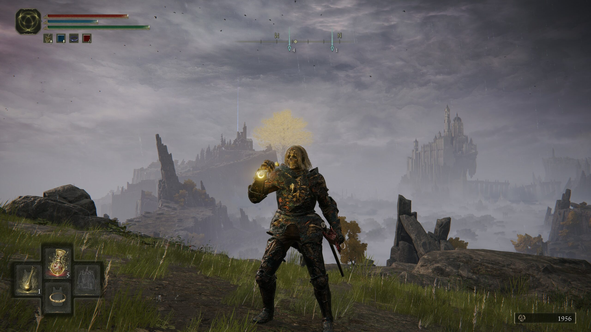
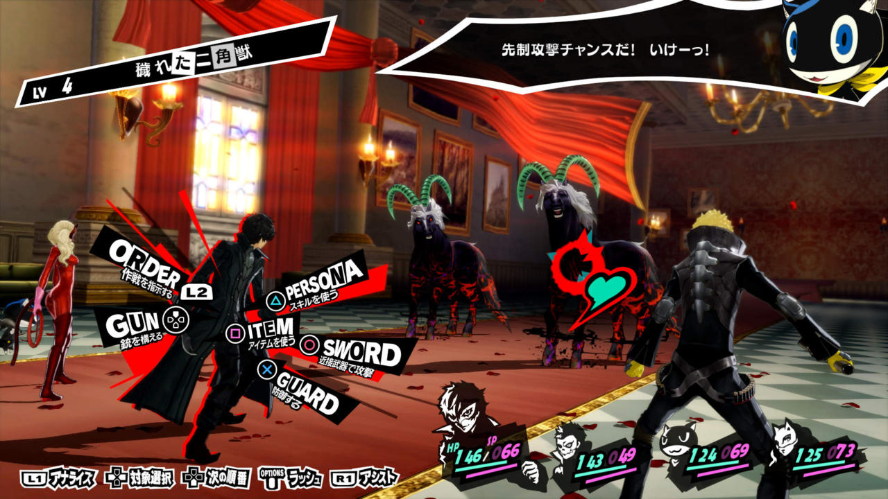

# Final Fantasy XIV HUD

### By Christian Hodges

For this usability journal, I want to talk about MMORPG Final Fantasy XIV's head's up display or HUD. As one can imagine, a HUD for a video game is very important to not only the aesthetics of the game but the usability as well. If a game has a poor HUD then players might not be able to perform at the level they want to. As some great examples of HUDs see some examples below:

 

With the first example in Elden Ring, there is a preference for conveying information but keeping it simple. The other example, Persona 5, is a lot slower game as a turn-based RPG so it can get away with being a lot more aesthetic with its design and making the HUD more difficult to read but flashier in appearance. Though, the HUD that I want to talk about today is from the MMORPG of Final Fantasy XIV (FFXIV). This game includes a way to customize your HUD so that it fits your playstyle. Here is a screenshot of my HUD:

Some notes about my HUD are that I prefer the bigger map, I have more action bars than normal, and I like to keep all of the UI elements off the edges of the screen so that I can see action easily. I also have a section on the bottom left of the screen which holds miscellaneous actions like jobs I can switch to and emotes. If I were to make myself into a **persona** then I would list some of my goals as follows:

- Christian likes to know which skills are available to him
- Christian sometimes doesn't care about the map, but will usually have the optional bigger map open rather than the always-on minimap
- He will use a keyboard and mouse
- This **persona** will switch jobs on a regular basis and likes to have their other jobs available to switch to
- When not doing anything this person likes to keep the majority of their screen uncluttered apart from the bottom of their screen.

Now let's look at another person's HUD from FFXIV. The following screenshot is the HUD from a popular FFXIV content creator named [Zepla HQ](https://www.youtube.com/channel/UCJwM0fiKe2rq7z2p8HPTyMA). The screenshot below is from their video talking about their [HUD setup](https://www.youtube.com/watch?v=R0buenOiW5Q&ab_channel=ZeplaHQ)

In one of their videos, they talk about the reasoning behind their HUD setup. Some of the things that they talk about are how they always want the health meter of the mob that they are attacking in the center of the screen so that they can see which the mob is about to cast and how much health they have left. Another thing that they have is all of the miscellaneous buttons that I had on my screen are hidden by their facecam. Since they are a content creator, they will have a facecam on when they are streaming or creating videos. This means that they themselves might need to click those buttons, but their viewers don't need to see that information. If I were a UX researcher for FFXIV I would list this **persona** as follows:

**Zepla HQ (she/her/hers)**

Zepla HQ is a content creator that enjoys playing Final Fantasy. They play a DPS job so for them, it is very important to be helpful to the team, but also have fun. Zepla plays a dancer because they find the job fun and fulfilling. They find it fulfilling since they can give buffs to the other members of their team while also being able to output a good amount of damage.

Sometimes, Zepla plays on autopilot while interacting with their chat or talking while creating videos. This means that they sometimes die to avoidable boss attacks. Because of this, Zepla changed their HUD layout to make it very clear how much health the boss has left and when the boss is about to do a big attack. Finally, since Zepla is a content creator she likes to have a facecam over the game while she streams on [Twitch.tv](https://twitch.tv/zeplahq). This means that she also likes to keep the majority of their non-job action commands off to the corner under their camera. Some of those action commands include emotes, teleport, food, jobs, and mount options.

[back to portfolio](../../) | [prev journal](../j02)
